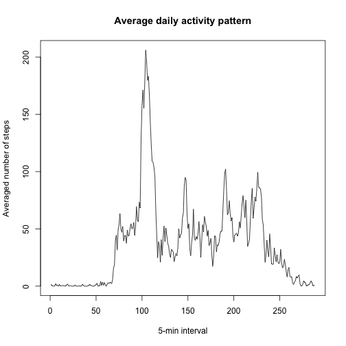
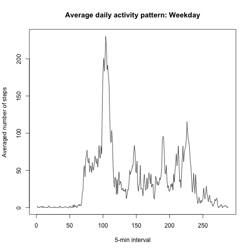

# Reproducible Research: Peer Assessment 1


## Loading and preprocessing the data
Directly download the dataset and load it accordingly. 


```r
url <- "https://d396qusza40orc.cloudfront.net/repdata%2Fdata%2Factivity.zip"
temp <- tempfile()
download.file(url, temp, method = "curl")
data <- read.csv(unz(temp, "activity.csv"))
unlink(temp)
```

## What is mean total number of steps taken per day?
### 1. Histogram of the total number of steps taken each day


```r
steps_per_day <- aggregate(steps ~ date, data, sum)$steps
hist(steps_per_day,
     main = "The total number of steps taken per day",
     xlab = "Steps", ylab = "Frequency (day)",
     breaks = 10)
```

 

### 2. The mean and median of the total number of steps taken per day


```r
steps.mean <- mean(steps_per_day)
steps.median <- median(steps_per_day)
```

The mean of the total number of steps is 10766 and the median is 10765.


## What is the average daily activity pattern?
### 1. Time series plot of the 5-minute interval and the average number of steps taken.

```r
# sbi: steps by interval
sbi <- aggregate(steps ~ interval, data, mean)
plot(sbi$steps, type = "l",
     main = "Average daily activity pattern",
     xlab = "5-min interval", ylab = "Averaged number of steps")
```

 

### 2. Which 5-minute interval, on average across all the days in the dataset, contains the maximum number of steps?


```r
max.interval = which.max(sbi$steps)
max.interval
data$interval[max.interval]
```

The maximum number of steps is 104 which is contained in the interval 835.


## Imputing missing values

### 1. The total number of missing values in the dataset


```r
sum(is.na(data))
```

The total number of missing values in the dataset is 2304.


### 2. Filling in all of the missing values in the dataset. 

The missing values were replaced by the mean value for its 5-minute interval.

### 3. A new dataset with the missing data filled in.


```r
imputation <- function(steps, interval) {
        temp.data <- NA
        if (!is.na(steps)) temp.data <- c(steps)
        else temp.data <- (sbi[sbi$interval == interval, "steps"])
        return (temp.data)
}

new.data <- data
new.data$steps <- mapply(imputation, new.data$steps, new.data$interval)
```

### 4. Analyze the new data

#### a. Histogram of the total number of steps taken each day 


```r
new.spd <- aggregate(steps ~ date, new.data, sum)$steps
hist(new.spd,
     main = "The total number of steps taken per day",
     xlab = "Steps", ylab = "Frequency (day)",
     breaks = 10)
```

 

#### b. The mean and median total number of steps taken per day. Compare to the data with missing values. What is the impact of imputing missing data on the estimates of the total daily number of steps?


```r
new.steps.mean <- mean(new.spd)
new.steps.median <- median(new.spd)
```

The mean of the total number of steps is 10766 and the median is 10766. The mean is same, but median is different. It is because missing values were filled in the average of its interval.


## Are there differences in activity patterns between weekdays and weekends?


```r
library(chron)
new.data$week<-factor(is.weekend(new.data$date), 
                      levels=c(T, F), labels=c("Weekend", "Weekday"))

new.sbi <- aggregate(steps ~ interval + week, new.data, mean)

plot(new.sbi[new.sbi$week=="Weekday",]$steps, type = "l",
     main = "Average daily activity pattern: Weekday",
     xlab = "5-min interval", ylab = "Averaged number of steps")
```

 

```r
plot(new.sbi[new.sbi$week=="Weekend",]$steps, type = "l",
     main = "Average daily activity pattern: Weekend",
     xlab = "5-min interval", ylab = "Averaged number of steps")
```

 
